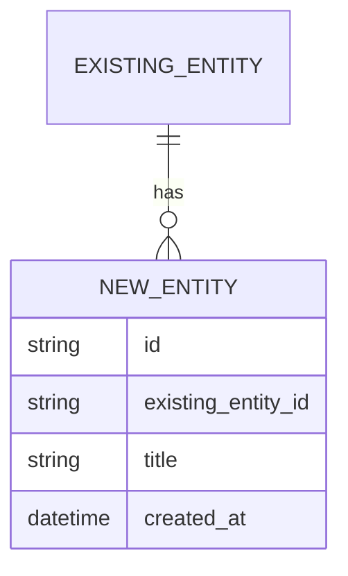
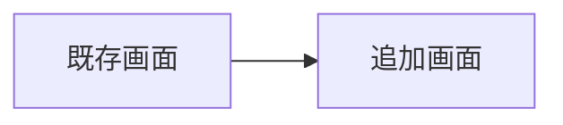

# 機能追加仕様書

> テンプレート利用上の注意:
> - `{…}` （半角波括弧）はすべて記入ガイドのプレースホルダ。仕様書化時には必ず実値で置換し、`{…}` ごと削除する。
> - 値が決まっていない項目は、`{…}` を削除したうえで `（要確認: 未決定）` を入れる。
> - 該当のないサブセクション（例: 「データモデルの差分」が無い場合）は「変更なし」と明記する。
> - 画面の「状態」行のうち、当該画面に存在しないもの（例: 純表示画面の「入力中」、モーダルの「読み込み中」）は省略してよい。
> - この注意ブロック自体も、仕様書を最終化する前に削除する。

# １．追加機能の概要（Why / What / 影響範囲を1枚で）

| 項目                         | 内容                                                                |
| ---------------------------- | ------------------------------------------------------------------- |
| 機能名（仮）                 | {機能名}                                                            |
| 一言説明                     | {何ができるようになるか。30字以内}                                  |
| 追加する背景・動機           | {プロトタイプ検証や運用で見えた具体的な不便・要望}                  |
| 対象ユーザー                 | {既存のターゲットユーザーと同じか / 新たなセグメントか}             |
| この機能で達成したいこと     | {実装後に「何が達成できれば成功か」}                                |
| 想定する利用頻度             | {日常的 / 特定タイミング / 一時的}                                  |

## ■ 既存仕様書との関係

| 項目                       | 内容                                                       |
| -------------------------- | ---------------------------------------------------------- |
| 参照する既存仕様書         | {例: docs/PROTOTYPE.md、docs/FEATURE-001.md}               |
| この機能の通し番号         | {例: FEATURE-002}                                          |
| 既存仕様の更新要否         | {あり / なし}                                              |

## ■ やらないこと

1項目以上書く。

-
-
-

# ２．機能仕様

## ■ F-XXX: {機能名}

| 項目               | 内容                                                                                       |
| ------------------ | ------------------------------------------------------------------------------------------ |
| 機能名             | {機能名}                                                                                   |
| 概要               | {1〜2文。何ができるか}                                                                     |
| 入力               | {ユーザーが与える情報。フォーム入力 / ファイル / URLパラメータなど}                        |
| 出力               | {結果として返るもの。画面表示 / 保存 / ダウンロード / 通知など}                            |
| 主要ロジック       | {肝になる処理。アルゴリズム・計算・外部API呼び出しなど}                                    |
| 主要なエラーケース | {失敗するケースと、そのときの最低限の挙動。「何もしない / リトライ / 画面表示」のどれか}   |
| 既存機能との関係   | {連携する既存機能 / 置き換える既存機能 / 独立}                                             |

## ■ 受け入れ条件

- [ ]
- [ ]
- [ ]

## ■ 操作の流れ（ハッピーパス）

1.
2.
3.

## ■ 最小の異常系

| ケース       | 発生条件 | 最低限の挙動                             |
| ------------ | -------- | ---------------------------------------- |
| 入力不足     |          | 画面にエラーメッセージを表示する         |
| 外部API失敗  |          | リトライせず、失敗したことを表示する     |
| 想定外エラー |          | 画面全体を落とさず、汎用エラーを表示する |

# ３．既存への影響範囲

## ■ 影響を受ける既存機能

| 既存機能ID | 既存機能名   | 影響内容                          | 破壊的変更       |
| ---------- | ------------ | --------------------------------- | ---------------- |
| {F-XXX}    | {既存機能名} | {挙動変更 / UI変更 / 内部のみ}    | {あり / なし}    |

## ■ 既存仕様書の更新箇所

| 仕様書         | 更新箇所     | 更新内容     |
| -------------- | ------------ | ------------ |
| {ファイル名}   | {更新箇所}   | {更新内容}   |

## ■ 移行・後方互換

- 既存データの扱い: {方針}
- 既存利用者への影響: {方針}
- フィーチャーフラグの要否: {要 / 不要}

# ４．データモデルの差分

既存のデータモデルからの差分のみを記載する。変更がない場合は「変更なし」と書く。

## ■ 追加エンティティ・フィールド

| エンティティ | 種別                | 追加・変更フィールド   | 備考     |
| ------------ | ------------------- | ---------------------- | -------- |
| {名前}       | {新規 / 既存変更}   | {フィールド}           | {備考}   |

## ■ マイグレーション方針

- 既存データの初期値: {方針}
- 必要なマイグレーション: {方針}
- ロールバック方針: {方針}

# ５．APIの差分

既存APIからの差分のみを記載する。

## ■ 追加・変更エンドポイント

| 種別 | メソッド   | パス       | 用途      | リクエスト概要 | レスポンス概要 | 破壊的変更       |
| ---- | ---------- | ---------- | --------- | -------------- | -------------- | ---------------- |
| 追加 | {METHOD}   | {/path}    | {用途}    | {概要}         | {概要}         | -                |
| 変更 | {METHOD}   | {/path}    | {用途}    | {概要}         | {概要}         | {あり / なし}    |

# ６．画面の差分

既存画面からの差分のみを記載する。

## ■ 追加・変更画面

各画面の「状態」は当該画面に存在しないもの（例: 純表示画面の「入力中」、モーダルの「読み込み中」）は行ごと削除してよい。

### ＜画面 S-XXX: {画面名}＞ 種別: {新規 / 変更}

- 役割: {この画面の目的}
- 主な要素:
  - {要素}
- 状態:
  - 初期状態: {表示内容}
  - 読み込み中: {表示内容}
  - 成功時: {表示内容}
  - エラー時: {表示内容}
- 主な遷移先:
  - S-XXX: {遷移条件}

## ■ 画面遷移図（差分）

新規・変更箇所のみ抜粋する。

# ７．次のアクション

この機能追加仕様書を確定したあとに進めること。

- [ ] Plan モードに移行し、本仕様を入力として実装計画を立てる
- [ ] 実装計画に沿って機能追加の実装に着手する
- [ ] 実装後、受け入れ条件を満たしているかを確認する
- [ ] 既存仕様書（PROTOTYPE.md / 過去のFEATURE.md）の更新が必要な場合は反映する
- [ ] この機能で達成したかったことが達成できたかを評価する
