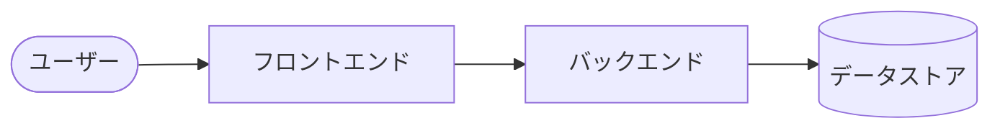
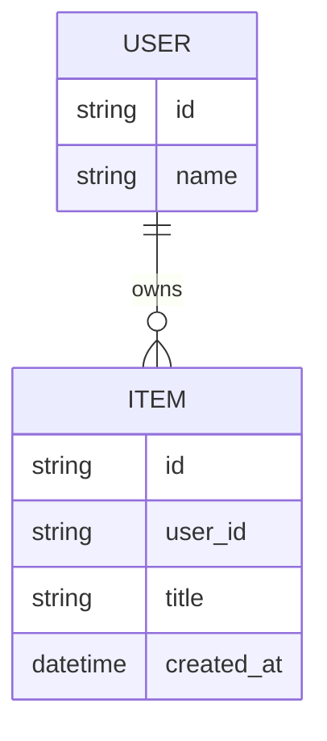
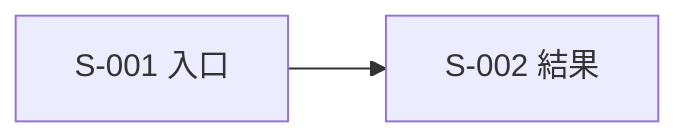

# プロトタイプ仕様書

> テンプレート利用上の注意:
> - `{…}` （半角波括弧）はすべて記入ガイドのプレースホルダ。仕様書化時には必ず実値で置換し、`{…}` ごと削除する。
> - 値が決まっていない項目は、`{…}` を削除したうえで `（要確認: 未決定）` を入れる。
> - 使わない F-XXX / S-XXX ブロックは削除してよい。
> - 画面の「状態」行のうち、当該画面に存在しないもの（例: 純表示画面の「入力中」、モーダルの「読み込み中」）は省略してよい。
> - この注意ブロック自体も、仕様書を最終化する前に削除する。

# １．概要（Why / Who / What を1枚で）

| 項目                         | 内容                                             |
| ---------------------------- | ------------------------------------------------ |
| プロダクト名（仮）           | {プロダクト名}                                   |
| 一言説明                     | {概要を30字以内}                                 |
| 解決したい課題               | {具体的な不便。抽象論ではなく実体験ベースで}     |
| ターゲットユーザー           | {ペルソナ1人または1セグメント}                   |
| プロトタイプで検証したいこと | {このプロトを動かして「何が分かれば成功か」}     |

## ■ やらないこと

3〜5項目を目安に書く。

-
-
-

# ２．コア機能

コア機能は1〜3個に絞る。使わない F-002 / F-003 ブロックは削除してよい。

## ■ F-001: {機能名}

| 項目               | 内容                                                                                       |
| ------------------ | ------------------------------------------------------------------------------------------ |
| 機能名             | {機能名}                                                                                   |
| 概要               | {1〜2文。何ができるか}                                                                     |
| 入力               | {ユーザーが与える情報。フォーム入力 / ファイル / URLパラメータなど}                        |
| 出力               | {結果として返るもの。画面表示 / 保存 / ダウンロード / 通知など}                            |
| 主要ロジック       | {肝になる処理。アルゴリズム・計算・外部API呼び出しなど}                                    |
| 主要なエラーケース | {失敗するケースと、そのときの最低限の挙動。「何もしない / リトライ / 画面表示」のどれか}   |

### 受け入れ条件

- [ ]
- [ ]
- [ ]

### 操作の流れ（ハッピーパス）

1.
2.
3.

### 最小の異常系

プロトタイプで最低限扱う異常系のみを書く。

| ケース       | 発生条件 | 最低限の挙動                             |
| ------------ | -------- | ---------------------------------------- |
| 入力不足     |          | 画面にエラーメッセージを表示する         |
| 外部API失敗  |          | リトライせず、失敗したことを表示する     |
| 想定外エラー |          | 画面全体を落とさず、汎用エラーを表示する |

## ■ F-002: {機能名}

| 項目               | 内容                                                                                       |
| ------------------ | ------------------------------------------------------------------------------------------ |
| 機能名             | {機能名}                                                                                   |
| 概要               | {1〜2文。何ができるか}                                                                     |
| 入力               | {ユーザーが与える情報}                                                                     |
| 出力               | {結果として返るもの}                                                                       |
| 主要ロジック       | {肝になる処理}                                                                             |
| 主要なエラーケース | {失敗ケースと最低限の挙動}                                                                 |

### 受け入れ条件

- [ ]
- [ ]
- [ ]

### 操作の流れ（ハッピーパス）

1.
2.
3.

### 最小の異常系

| ケース       | 発生条件 | 最低限の挙動                             |
| ------------ | -------- | ---------------------------------------- |
| 入力不足     |          | 画面にエラーメッセージを表示する         |
| 外部API失敗  |          | リトライせず、失敗したことを表示する     |
| 想定外エラー |          | 画面全体を落とさず、汎用エラーを表示する |

## ■ F-003: {機能名}

| 項目               | 内容                                                                                       |
| ------------------ | ------------------------------------------------------------------------------------------ |
| 機能名             | {機能名}                                                                                   |
| 概要               | {1〜2文。何ができるか}                                                                     |
| 入力               | {ユーザーが与える情報}                                                                     |
| 出力               | {結果として返るもの}                                                                       |
| 主要ロジック       | {肝になる処理}                                                                             |
| 主要なエラーケース | {失敗ケースと最低限の挙動}                                                                 |

### 受け入れ条件

- [ ]
- [ ]
- [ ]

### 操作の流れ（ハッピーパス）

1.
2.
3.

### 最小の異常系

| ケース       | 発生条件 | 最低限の挙動                             |
| ------------ | -------- | ---------------------------------------- |
| 入力不足     |          | 画面にエラーメッセージを表示する         |
| 外部API失敗  |          | リトライせず、失敗したことを表示する     |
| 想定外エラー |          | 画面全体を落とさず、汎用エラーを表示する |

# ３．技術スタック・構成（走り出せる粒度で決める）

## ■ 技術スタック

| 領域                 | 採用              | 理由（なぜこれ？）  |
| -------------------- | ----------------- | ------------------- |
| 言語                 | {採用技術}        | {選定理由}          |
| フレームワーク（FE） | {採用技術}        | {選定理由}          |
| フレームワーク（BE） | {採用技術}        | {選定理由}          |
| データストア         | {採用技術}        | {選定理由}          |
| ホスティング         | {採用技術}        | {選定理由}          |
| 認証                 | {あり / なし}     | {選定理由}          |
| その他外部サービス   | {採用技術}        | {選定理由}          |

## ■ 制約・前提

- 月額コスト上限: {例: 0円 / 1,000円以下}
- デプロイ先: {無料枠 / 既契約 / 新規契約}
- 既に手元にあるアカウント・APIキー: {例: GitHub / Vercel / OpenAI APIキー}
- 対象ブラウザ / 実行環境: {例: 最新Chrome / iOS Safari}
- 開発に使える時間: {例: 平日夜2時間 + 週末}
- 本番品質を求めない範囲: {例: 同時アクセス1人想定でよい}

## ■ 構成図

# ４．データモデル（最小）

主要エンティティのみ。3〜5個に収める。

| エンティティ | 主なフィールド | 備考     |
| ------------ | -------------- | -------- |
| {名前}       | {フィールド}   | {備考}   |

# ５．API スケッチ

コア機能を満たす最小エンドポイントのみ。認証・バリデーション・エラーフォーマットの詳細はプロトタイプ段階では掘らない。

| メソッド | パス      | 用途      | リクエスト概要 | レスポンス概要 |
| -------- | --------- | --------- | -------------- | -------------- |
| GET      | {/path}   | {用途}    | {概要}         | {概要}         |
| POST     | {/path}   | {用途}    | {概要}         | {概要}         |

# ６．画面スケッチ

主要画面を3枚以内で。使わない画面ブロックは削除してよい。

## ■ 画面定義

各画面の「状態」は当該画面に存在しないもの（例: 純表示画面の「入力中」、モーダルの「読み込み中」）は行ごと削除してよい。

### ＜画面 S-001: {画面名}＞

- 役割: {この画面の目的}
- 主な要素:
  - {要素}
- 状態:
  - 初期状態: {表示内容}
  - 入力中: {表示内容}
  - 読み込み中: {表示内容}
  - 成功時: {表示内容}
  - エラー時: {表示内容}
- 主な遷移先:
  - S-002: {遷移条件}

### ＜画面 S-002: {画面名}＞

- 役割: {この画面の目的}
- 主な要素:
  - {要素}
- 状態:
  - 初期状態: {表示内容}
  - 読み込み中: {表示内容}
  - 成功時: {表示内容}
  - エラー時: {表示内容}
- 主な遷移先:
  - {遷移条件}

## ■ 画面遷移図

# ７．次のアクション

このプロトタイプ仕様書を確定したあとに進めること。

- [ ] Plan モードに移行し、本仕様を入力として実装計画を立てる
- [ ] 実装計画に沿ってプロトタイプ実装に着手する
- [ ] プロトタイプを動かして「1. 概要 / 検証したい仮説」を確かめる
- [ ] 検証結果をふまえて、本格実装に進むか・要件を見直すか・撤退するかを判断する
